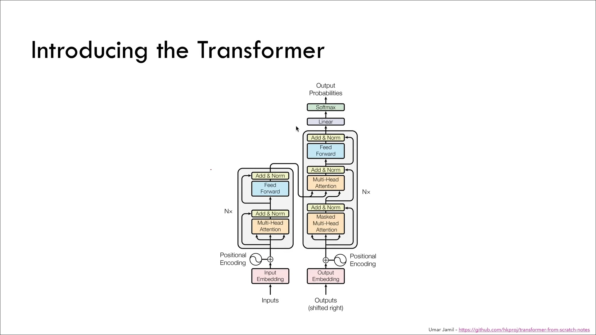
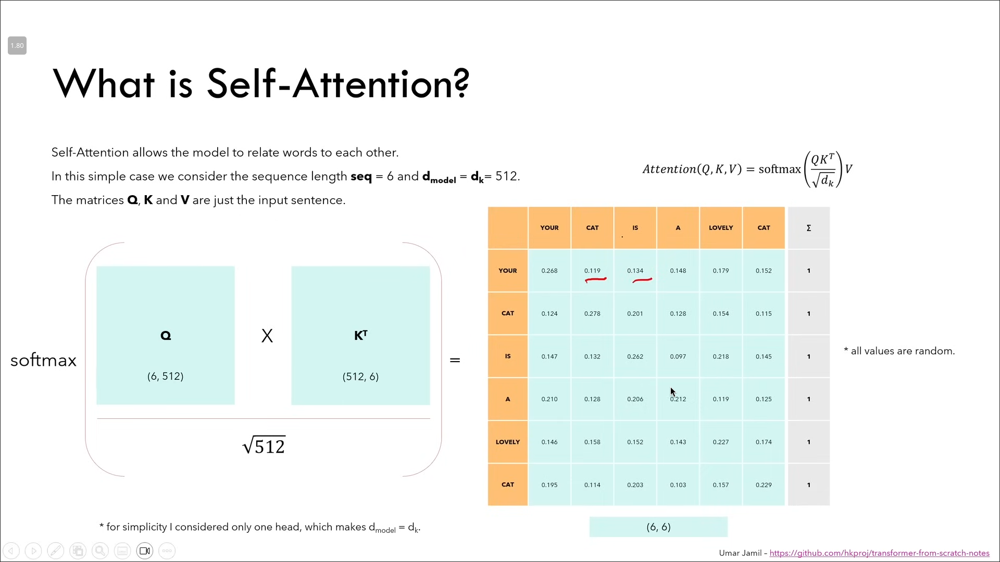
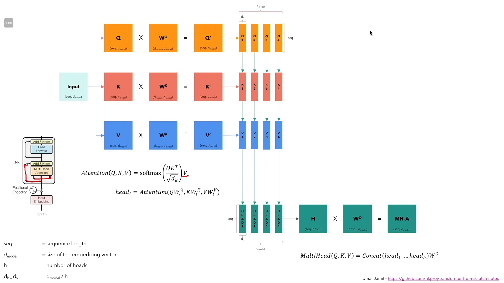

# Attention is All You Need (Transformer)

## Recurrent Neural Network (RNN)

Recurrent Neural Networks (RNNs) were traditionally used for sequence modeling tasks, particularly in Natural Language Processing (NLP). When processing a sentence, we first divide it into smaller chunks called tokens (typically words or subwords). These tokens form a sequence that is processed one element at a time. Each RNN unit takes two inputs: the current token in the sequence and the hidden state from the previous time step (or an initial state for the first token). The RNN then produces an output and updates its hidden state, which carries information forward to the next step.

**Limitations of RNNs:**
- **Sequential Processing**: Since we process one word at a time and each step depends on the previous hidden state, computation cannot be parallelized, making training slow.
- **Vanishing and Exploding Gradient Problem**: During backpropagation through time, gradients can become extremely small (vanish) or extremely large (explode), making it difficult to learn long-range dependencies.
- **Limited Long-term Memory**: Since information is passed only through the previous hidden state, the model struggles to maintain relationships between tokens that are far apart in the sequence. For example, relating the 1st word to the 10th word becomes increasingly difficult as the distance grows.

## Transformer

To solve the problems inherent in RNNs, the Transformer architecture was introduced in the paper "Attention is All You Need" (Vaswani et al., 2017). The key innovation is replacing recurrence with an attention mechanism that can directly model relationships between all positions in a sequence, regardless of their distance. The Transformer consists of two main components: the Encoder and the Decoder.

### Encoder

The Encoder is responsible for processing the input sequence and creating a rich representation that captures the meaning and context of each token. It begins with input embedding.

**Input Embedding:**
When we have a sentence, we first split it into individual words or smaller subword units through a process called tokenization. Each token is then mapped to a unique integer based on its position in our vocabulary (the complete set of all tokens the model knows). Finally, this integer is converted into a dense vector of size 512 (in the original paper). This process is called word embedding. The key property of embeddings is that the same word always maps to the same vector initially. However, during training, these embedding vectors are learned parameters that get updated through backpropagation, but the mapping between words and their vector positions remains consistent.

### Positional Encoding

Since the Transformer processes all tokens in parallel (unlike RNNs which process sequentially), it has no inherent notion of word order. Positional encoding solves this by adding information about each token's position in the sequence to its embedding. The goal is to ensure that the model treats words that appear close to each other as positionally similar, and words that are far apart as positionally distant.

Positional encodings are computed using sine and cosine functions of different frequencies. For a position `pos` in the sequence and dimension `i` in the embedding:

- For even dimensions: $PE_{(pos, 2i)} = \sin\left(\frac{pos}{10000^{2i/d_{model}}}\right)$
- For odd dimensions: $PE_{(pos, 2i+1)} = \cos\left(\frac{pos}{10000^{2i/d_{model}}}\right)$

These positional encodings are computed once and remain fixed throughout the model's lifetime (both during training and inference). They are added element-wise to the input embeddings, giving each token both semantic meaning (from the embedding) and positional information (from the positional encoding).

### Self-Attention

Self-attention is the core mechanism that allows the model to relate different words in the sequence to each other. Unlike RNNs where information flows sequentially, self-attention computes direct relationships between every pair of tokens simultaneously.

The attention mechanism uses three vectors derived from the input:
- **Q (Query)**: Represents what the current token is "looking for"
- **K (Key)**: Represents what information each token "offers"
- **V (Value)**: Represents the actual content/information of each token

The attention formula is:

$$\text{Attention}(Q, K, V) = \text{softmax}\left(\frac{QK^T}{\sqrt{d_k}}\right)V$$

Where:
- `Q` is the query matrix
- `K` is the key matrix (transposed for multiplication)
- `d_k` is the dimension of the key vectors (used for scaling to prevent large dot products)
- `V` is the value matrix

The matrix multiplication $QK^T$ produces an attention score matrix where each cell `(i, j)` represents how much token `i` should attend to token `j`. The softmax function normalizes these scores so that each row sums to 1, creating a probability distribution over all tokens for each position.

The final output is obtained by multiplying these attention weights with the Value matrix. The result is a new representation for each token that incorporates not just its own embedding and positional information, but also contextual information from all other tokens in the sequence, weighted by their relevance.

### Multi-Head Attention

Instead of performing a single attention function, Multi-Head Attention runs multiple attention operations in parallel, each with different learned linear projections. This allows the model to jointly attend to information from different representation subspaces at different positions.

The process works as follows:
1. The input is used to create four copies: one goes directly to the residual connection, and three are used to create Q, K, and V matrices.
2. **Q (Query), K (Key), V (Value) Explained**: These are the three fundamental components of attention:
   - **Query (Q)**: Think of it as a question each token asks: "What other tokens should I pay attention to?"
   - **Key (K)**: Think of it as a label each token provides: "Here is what kind of information I contain."
   - **Value (V)**: The actual information content: "Here is my information if you decide to attend to me."
3. Each of Q, K, and V is multiplied by separate learned weight matrices ($W^Q$, $W^K$, $W^V$) to create projections.
4. These projected matrices are split column-wise into multiple heads. So each head sees the full sequence but operates on a smaller portion of the embedding dimensions.
5. Each head independently computes attention using the scaled dot-product attention formula.
6. The outputs from all heads (head_1, head_2, etc.) are concatenated and multiplied by another learned matrix $W^O$ to produce the final multi-head attention output.

The benefit of this approach is that different heads can learn to focus on different types of relationships. For example:
- One head might learn grammatical relationships (subject-verb agreement)
- Another head might learn semantic relationships (nouns and their modifiers)
- Yet another might focus on syntactic structure (identifying clauses)

### Add and Norm

After each sub-layer (attention or feed-forward), the Transformer applies a residual connection followed by layer normalization. The residual connection adds the input of the sub-layer to its output, helping with gradient flow during training. Layer normalization then scales the values to have zero mean and unit variance, bringing all values into a consistent range. This stabilizes training and helps the model converge faster.

### Decoder

The Decoder has a similar structure to the Encoder but with an additional component: a cross-attention layer that connects to the Encoder's output. Here is how it works:

1. The Encoder processes the input sequence and produces a set of representations.
2. These Encoder outputs are used as the Keys (K) and Values (V) for the cross-attention layer in the Decoder.
3. The Decoder's own output (after masked self-attention) serves as the Query (Q) for this cross-attention.
4. This allows each position in the Decoder to attend to all positions in the Encoder's output, effectively letting the Decoder "look at" the entire input sequence while generating each output token.

### Masked Multi-Head Attention

In the Decoder, we use Masked Multi-Head Attention to ensure that the model cannot look at future tokens during training. This is essential because during inference, the model generates tokens one at a time and should not have access to tokens that have not been generated yet.

The masking works by setting the attention scores for all positions to the right of the diagonal (future positions) to negative infinity before applying softmax. When softmax is applied, these negative infinity values become zero, effectively preventing the model from attending to future tokens. This ensures that the prediction for position `i` can only depend on the known outputs at positions less than `i`.

## Training

Let us walk through a training example. Suppose we want to translate the English sentence "I love you so much" to Italian.

**Step 1: Prepare the Input**
- Add special tokens: `<SOS> I love you so much <EOS>` (Start Of Sequence and End Of Sequence markers)
- Compute input embeddings for each token
- Add positional encodings
- Pass through the Encoder to get the Encoder output

**Step 2: Prepare the Target**
- The Italian translation is "Ti amo molto"
- For the Decoder input, we prepend the start token: `<SOS> Ti amo molto`
- Compute input embeddings and add positional encodings

**Step 3: Decoder Processing**
- Pass the prepared Decoder input through masked multi-head attention (so each position only sees previous positions)
- The result is used as the Query for cross-attention with the Encoder output (Keys and Values)
- After all Decoder layers, we get an output of shape (sequence_length, d_model) which is still in embedding space

**Step 4: Output Projection**
- A linear layer maps from (sequence_length, d_model) to (sequence_length, vocab_size)
- This tells us, for each position, the score for every word in our vocabulary
- Softmax converts these scores to probabilities

**Step 5: Loss Calculation**
- Our ground truth (target) is: `Ti amo molto <EOS>` (shifted by one position from the Decoder input)
- We compare the model's predicted probabilities with the target using cross-entropy loss
- Backpropagation updates all model parameters to reduce this loss

## Inference

During inference (actually using the trained model), the process is different because we do not have the target sequence:

**Step 1**: Pass the input through the Encoder: `<SOS> I love you so much <EOS>`
- The Encoder processes this once and its output remains fixed throughout inference

**Step 2**: Initialize the Decoder with just `<SOS>`
- Time step 1: The Decoder takes `<SOS>` and outputs probability distribution over vocabulary
- The model predicts `Ti` as the most likely next token
- Output so far: `<SOS> Ti`

**Step 3**: Feed the output back to the Decoder
- Time step 2: The Decoder takes `<SOS> Ti` and predicts `amo`
- Output so far: `<SOS> Ti amo`

**Step 4**: Continue this autoregressive process
- Time step 3: Input `<SOS> Ti amo`, predict `molto`
- Time step 4: Input `<SOS> Ti amo molto`, predict `<EOS>`

**Step 5**: Stop when `<EOS>` is generated
- The final translation is: `Ti amo molto`

Note that the Encoder only runs once at the beginning, while the Decoder runs iteratively, generating one token at a time. At each time step, the Decoder can attend to all previously generated tokens (through masked self-attention) and the full Encoder output (through cross-attention).
